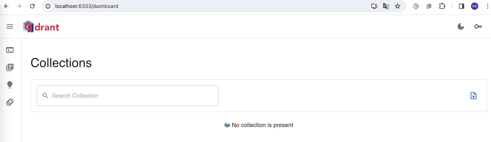
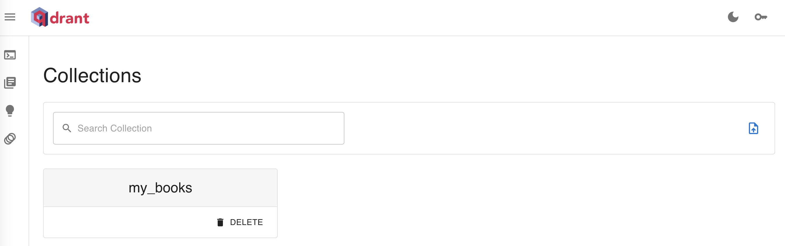
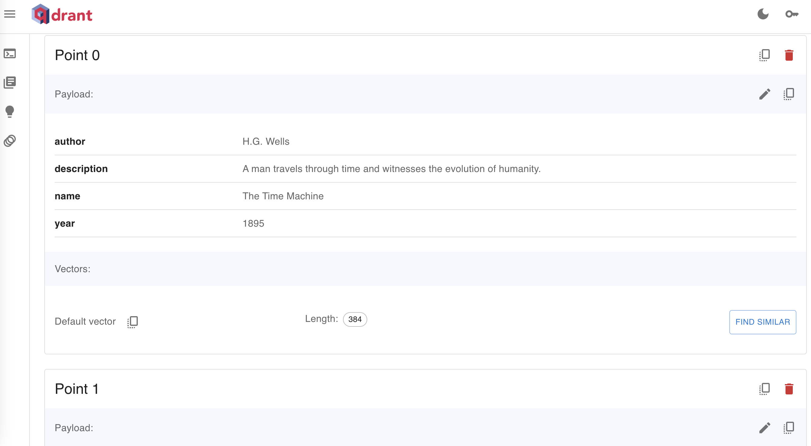

# neural search
## 参考
[Create a Simple Neural Search Service](https://qdrant.tech/documentation/tutorials/neural-search/)  

## データ用意
```
$ cd data/startups/
$ wget https://storage.googleapis.com/generall-shared-data/startups_demo.json
```

## エンべディング用モデル用意とベクトル化
```
entence_transformer_model = "all-MiniLM-L6-v2"
model = SentenceTransformer(
    entence_transformer_model,
    device="cpu"  # "cuda"だとGPU
)

df = pd.read_json("../data/startups/startups_demo.json", lines=True)

vectors = model.encode(
    [row.alt + ". " + row.description for row in df.itertuples()],
    show_progress_bar=True,
)
```

上記で約20分かかる。(macbookairのCPU。40474件のテキスト。)  


## qdrantの利用設定
```
$ docker pull qdrant/qdrant
$ docker run -p 6333:6333 qdrant/qdrant
```

上記を実行すると、`http://localhost:6333/dashboard` で以下の画面にアクセスできるようになる。  



## pythonモジュールinstall
```
$ poetry add sentence-transformers
$ poetry add qdrant-client
```

## コード
### データ用意
```
documents = get_tutorial_data()
```

データは、jsonのリストで、jsonは文章や属性値などをセットできる。  

### embeddingモデル準備
```
from sentence_transformers import SentenceTransformer
encoder = SentenceTransformer("all-MiniLM-L6-v2")
```

sentencetransformersのモデルを[haggingface](https://huggingface.co/models?library=sentence-transformers)から取得する。  
librariesにsentence-transformersを指定してよさそうなものを選ぶ。  

### qdrantのストレージの場所の指定とcollection(テーブル)の作成
```
# ストレージの場所の指定
qdrant = QdrantClient(":memory:")  # メモリ上に作成
# qdrant = QdrantClient("localhost", port=6333)  # docker上に作成

# collectionの作成
qdrant.recreate_collection(  # recreate_collectionはcollectionが既に存在すれば削除して作成し直す。
    collection_name="my_books",
    vectors_config=models.VectorParams(
        size=encoder.get_sentence_embedding_dimension(),  # Vector size is defined by used model
        distance=models.Distance.COSINE,
    ),
)
```

QdrantClientの引数で、ストレージの場所を指定する。  
`":memory:"`でメモリ上を指定し、`"localhost", port=6333`だとdocker上を指定することになる。  

docker上に作成した場合、 qdrantのwebページに以下のようにcollection名が表示される。


これをクリックすると、以下のようにデータが確認できる。


`collection`は、テーブルのような概念で、qdrant.recreate_collectionで作成する。  
recreateの名前のとおり、既存のものが存在する場合、削除して作り直す。  
`collection_name`はテーブル名で、`vectors_config`でセマンティック検索対象のベクトルの設定を指定する。  

### データの登録
```
qdrant.upload_points(
    collection_name="my_books",
    points=[
        models.PointStruct(
            id=idx, vector=encoder.encode(doc["description"]).tolist(), payload=doc
        )
        for idx, doc in enumerate(documents)
    ],
)
```

`upload_points`でデータを登録する。  
collection_nameで、データを登録するcollectionを指定する。  
documentsのループの中で、descriptionを対象にencoderでベクトル化することを指定する。  
description以外の値は、属性値として登録される。  

### 検索と結果の表示
```
hits = qdrant.search(
    collection_name="my_books",
    query_vector=encoder.encode("alien invasion").tolist(),
    limit=3,
)
for hit in hits:
    print(hit.payload, "score:", hit.score)
```

`qdrant.search`で自然言語による検索を実施する。  
collection_nameで対象のテーブルを指定し、query_vectorで検索クエリをエンべディングしたものを指定する。  
limitは取得する上位件数。  
取得結果のhitsはリストになっており、hits[0].payloadでデータの中身を、hits[0].scoreでスコアを取得できる。  
     
以下のように、`query_filter`を指定することで、検索結果を絞り込むことができる。  
yearが2000以上の物だけを指定する場合の例。  

```
hits = qdrant.search(
    collection_name="my_books",
    query_vector=encoder.encode("alien invasion").tolist(),
    query_filter=models.Filter(
        must=[models.FieldCondition(key="year", range=models.Range(gte=2000))]
    ),
    limit=1,
)
```
